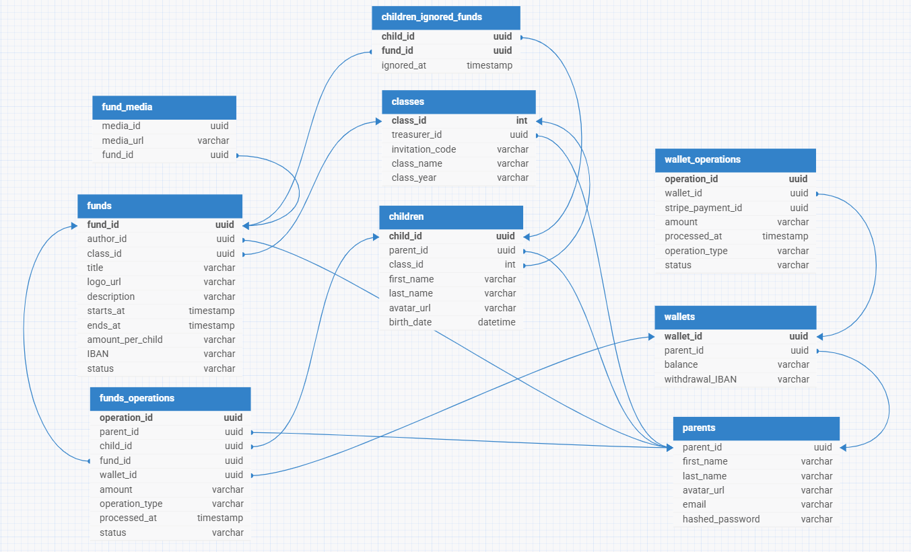

# SchoolMoney (backend)

SchoolMoney is a platform designed to simplify school payments. Parents can top up their account via Stripe and receive a balance in their digital wallet. They can then create a school class, becoming the class treasurer, while other parents can contribute payments for their own children to funds created within the class. Funds can be created by the class treasurer, and each parent can create their own class as well. The platform also automates refunds if a fund is cancelled.

---

# Table of Contents

1. [Application Functionalities](#application-functionalities)
2. [Tech Stack](#tech-stack)
3. [Database Scheme](#database-scheme)
4. [How to Run the Project](#how-to-run-the-project)
5. [Author](#author)

---

# Application Functionalities:
- wallet top-up: parents can add funds to their account via Stripe.
- class creation: parents can create their own school class and become the class treasurer.
- fund management: class treasurers can create funds for school expenses.
- parent contributions: other parents can contribute to funds for their children within the class.
- automated refunds: if a fund is cancelled, payments are automatically refunded to contributors as balance to their wallet.
- flexible school class system: every parent has the ability to create their own class and manage their own funds.

---

# Tech Stack

- **Backend:** Java SpringBoot
- **Database:** Postgres
- **Authentication:** JWT (JSON Web Tokens), email-based account activation
- **Payments:** Stripe API (wallet top-up, withdrawal)
- **Email Services:** SMTP (account activation)
- **API Documentation:** Swagger / OpenAPI
- **Hosting:** AWS (EC2 instance)
- **Environment Management:** `.env`
- **Containerization:** DockerDesktop

---

# Database scheme:



---

# How to Run the Project:

## Prerequisites

- Java 21+
- Docker

## Step-by-step

1. **Clone the repository:**

    ```powershell
    git clone https://github.com/JakubJagodzinski/school-money-backend.git
    ```

2. **Navigate to the project directory:**

    ```powershell
    cd school-money-backend
    ```

3. **Copy the `.env.example` file to `.env` and fill in the required environment variables:**

    ```powershell
    copy .env.example .env
    ```

4. build docker image

    ```powershell
    docker compose build
    ```

5. **Create and run containers**

    ```powershell
    docker compose up -d
    ```

---

# Author

Jakub Jagodziński
