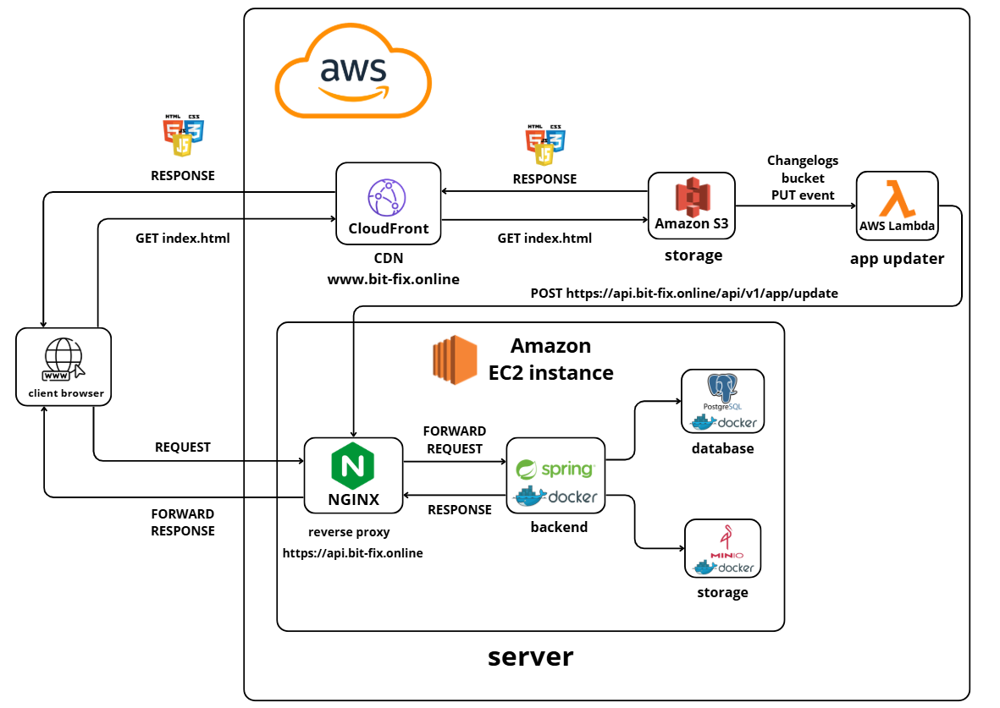
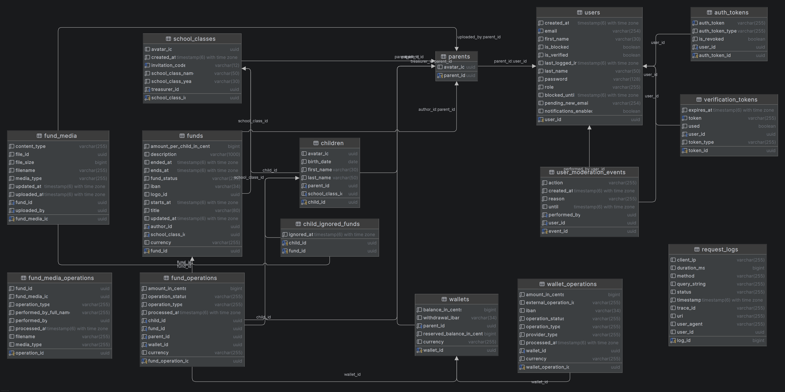

# SchoolMoney (backend)

SchoolMoney is a platform designed to simplify school payments.
Parents can top up their digital wallet via Stripe, create school classes, and manage funds for school expenses.
The system allows parents to contribute to funds for their children and automatically handles refunds if a fund is
canceled.

---

# Table of Contents

1. [Tech Stack](#tech-stack)
2. [System architecture](#system-architecture)
3. [Modules Overview](#modules-overview)
4. [Database Schema](#database-schema)
5. [Swagger Documentation](#swagger-documentation)
6. [Hosting](#hosting)
7. [Environment Variables](#environment-variables)
8. [How to Run the Project](#how-to-run-the-project)
9. [Author](#author)

---

# Tech Stack

- **Backend:** Java Spring Boot
- **Database:** PostgreSQL
- **Storage:** MinIO
- **Authentication:** JWT, email-based account activation
- **Authorization:** Role-based and fine-grained permissions
- **Payments:** Stripe API (wallet top-ups)
- **Cron Jobs:** Spring @Scheduled
- **Logging:** Logback
- **PDF Generation:** OpenPDF
- **Dependency Management:** Maven
- **Email Services:** SMTP (account-related actions and general notifications)
- **API Documentation:** Swagger / OpenAPI
- **Hosting:** AWS (EC2 instance), AWS S3, AWS CloudFront, Nginx
- **Environment Management:** `.env`
- **Containerization:** Docker
- **Deployment:** Docker Compose

---

# System architecture

The application follows a modular backend architecture built with Java Spring Boot.

- Each module encapsulates specific business logic.
- PostgreSQL stores persistent data.
- MinIO handles file storage.
- Backend, database, and storage are hosted on AWS EC2 instance.
- Nginx reverse proxy routes incoming traffic to backend services and handles SSL termination.
- S3 stores HTML, js, and CSS compiled [school-money-frontend](https://github.com/BartlomiejJaruga/school-money) files.
- CloudFront provides CDN for static content.



---

# Modules Overview

### 1. User Module

- Handles all user-related functionalities:
- Account creation with email verification
- Change of first and last name
- Avatar management (set/remove/get)
- Email change and password management (change/reset)
- Email notifications mute/unmute
- Role-based authorization
- JWT authentication
- Account blocking/unblocking by admin
- Account block history (who, why, duration)
- Configurable super-admin account on first launch
- Super-admin can create admin accounts
- Automatic unblocking of expired accounts (cron job)

### 2. Parent Module

- Retrieves aggregated history of fund payments and wallet transactions for a parent

### 3. Wallet Module

- Retrieve full wallet info (balance, currency, IBAN)
- Get wallet balance with currency
- Manage IBAN for withdrawals
- Top-up wallet via Stripe
- Simulated withdrawals
- Record and retrieve wallet transaction history

### 4. Child Module

- Create/edit child profile
- Child avatar management
- Retrieve all children for a parent
- Generate a financial report for a child

### 5. Class Module

- Create and edit classes (name, year)
- Class avatar management
- Add/remove children using unique class code
- Generate new class code
- Retrieve all children in class
- Generate a financial report for class

### 6. Fundraising Module

- Create, edit, and cancel fundraisers
- Fundraiser logo management
- Admin block/unblock fundraiser
- Ignore/unignore fundraiser per child
- Retrieve all fundraisers by parent or class
- Auto-close fundraisers hourly (cron job)
- Generate fundraiser report

### 7. Attachments Module

- Add/remove attachments of any type to funds
- Retrieve attachments and metadata
- File logo management
- Metadata editing (name/type)
- Validate allowed types and sizes
- Track attachment operations history

### 8. Fund Financial Module

- Record financial transactions for fundraisers
- Retrieve all transactions per fundraiser
- Deposit/withdraw funds by treasurer
- Parent contributions
- Automatic refund to parents when a fundraiser is canceled

### 9. Email Module

#### Sends emails for:

- Account verification, password reset, email change
- Account block/unblock notifications
- Wallet top-up and withdrawal notifications
- Copies of financial reports (child, class, fundraiser)
- New fundraiser notifications to parents and treasurers
- Refund notifications to parents

---

# Database schema:



---

# Swagger Documentation

[Swagger UI](https://jakubjagodzinski.github.io/school-money-backend/)

---

# Hosting

[website](https://www.bit-fix.online)

[server api](https://api.bit-fix.online/swagger-ui/index.html)

---

# Environment Variables

From `.env.example` create an `.env` file in the root directory and define the following variables:

| Variable                          | Description                                  | Example                                         |
|-----------------------------------|----------------------------------------------|-------------------------------------------------|
| `POSTGRES_USER`                   | PostgreSQL username                          | `postgres`                                      |
| `POSTGRES_PASSWORD`               | PostgreSQL password                          | `postgres`                                      |
| `POSTGRES_DB`                     | PostgreSQL database name                     | `school_money`                                  |
| `DATASOURCE_URL`                  | JDBC URL for connecting to PostgreSQL        | `jdbc:postgresql://localhost:5433/school_money` |
| `JWT_SECRET_KEY`                  | Secret key used for signing JWT tokens       | `your_jwt_secret`                               |
| `JWT_EXPIRATION`                  | JWT token expiration in milliseconds         | `86400000`                                      |
| `JWT_REFRESH_TOKEN_EXPIRATION`    | JWT refresh token expiration in milliseconds | `604800000`                                     |
| `SERVER_PUBLIC_ADDRESS`           | Backend public URL                           | `http://localhost:8090`                         |
| `PASSWORD_RESET_ALLOWED_URLS`     | Urls allwoed as redirect url for links       | `http://localhost:8090`                         |
| `ALLOWED_ORIGINS`                 | Allowed origins                              | `http://localhost:8090`                         |
| `ALLOWED_METHODS`                 | Allowed methods                              | `GET,POST,PATCH,DELETE,OPTIONS`                 |
| `ALLOWED_HEADERS`                 | Allowed headers                              | `*`                                             |
| `MAIL_HOST`                       | SMTP host for sending emails                 | `smtp.gmail.com`                                |
| `MAIL_PORT`                       | SMTP port                                    | `587`                                           |
| `MAIL_USERNAME`                   | SMTP username/email                          | `example@gmail.com`                             |
| `MAIL_PASSWORD`                   | SMTP password                                | `your_email_password`                           |
| `STRIPE_API_KEY`                  | Stripe secret key for payments               | `sk_test_...`                                   |
| `STRIPE_PAYMENT_WEBHOOK_SECRET`   | Stripe webhook secret for payments           | `whsec_...`                                     |
| `STRIPE_PAYOUT_WEBHOOK_SECRET`    | Stripe webhook secret for payouts            | `whsec_...`                                     |
| `ALLOWED_EMAIL_DOMAINS`           | Allowed email domains for registration       | `gmail.com,outlook.com`                         |
| `VERIFICATION_TOKEN_EXPIRY_HOURS` | Expiration time for verification tokens      | `1`                                             |
| `VERIFICATION_TOKEN_LENGTH`       | Length of verification token                 | `36`                                            |
| `MINIO_URL`                       | MinIO storage endpoint                       | `http://localhost:9000`                         |
| `MINIO_ROOT_USER`                 | MinIO root username                          | `minioadmin`                                    |
| `MINIO_ROOT_PASSWORD`             | MinIO root password                          | `minioadmin`                                    |
| `SUPER_ADMIN_FIRST_NAME`          | First name for the super admin               | `Super`                                         |
| `SUPER_ADMIN_LAST_NAME`           | Last name for the super admin                | `Admin`                                         |
| `SUPER_ADMIN_EMAIL`               | Email for the super admin                    | `example@gmail.com`                             |
| `SUPER_ADMIN_PASSWORD`            | Password for the super admin                 | `supersecurepassword`                           |
| `FINANCES_CURRENCY`               | Default currency for finances                | `PLN`                                           |
| `FINANCES_STARTING_BALANCE`       | Default starting balance for new accounts    | `1000000`                                       |
| `APP_UPDATE_SECRET_KEY`           | Secret to authorize on app update endpoint   | `23ed76a...`                                    |

---

# How to Run the Project:

## Prerequisites

- Java 21+
- Docker

## Step-by-step

1. **Clone the repository:**

    ```powershell
    git clone https://github.com/JakubJagodzinski/school-money-backend.git
    ```

2. **Navigate to the project directory:**

    ```powershell
    cd school-money-backend
    ```

3. **Copy the `.env.example` file to `.env` and fill in the required environment variables:**

    ```powershell
    copy .env.example .env
    ```

4. build docker image

    ```powershell
    docker compose build
    ```

5. **Create and run containers**

    ```powershell
    docker compose up -d
    ```

---

# Author

Jakub Jagodziński
